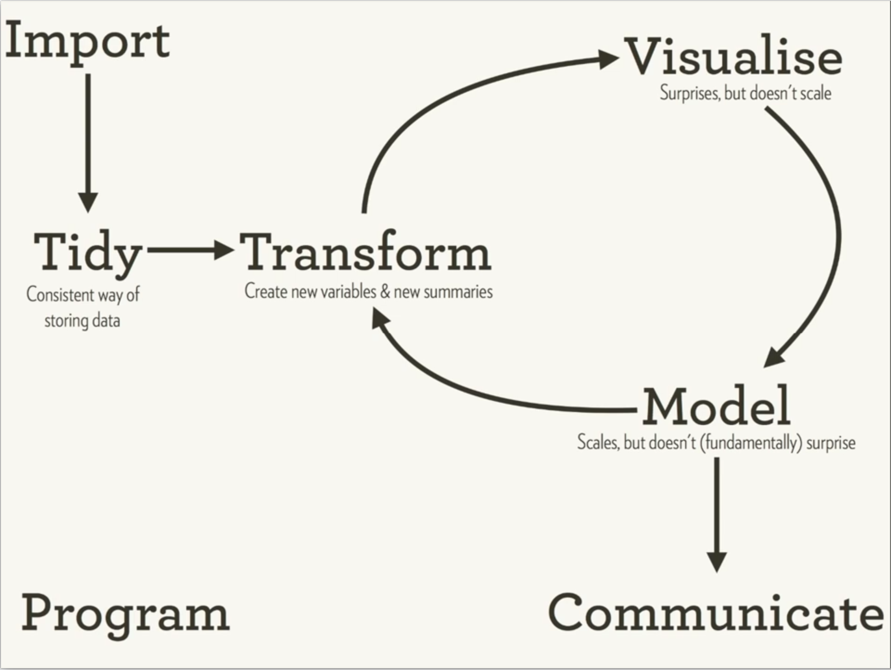

```{r setup, include=FALSE}
knitr::opts_chunk$set(echo = FALSE)
knitr::opts_chunk$set(highlight = TRUE)
```

## 可视化在R语言数据分析过程中的位置 | 探索分析、解释表达 {.smaller}

<div align="center">    

</div>

[Hadley Wickham Data Science with R : http://v.youku.com/v_show/id_XMjYzMzMwNjQ2MA==.html](http://v.youku.com/v_show/id_XMjYzMzMwNjQ2MA==.html)

## 主要探讨的内容

- Base R Plot (R语言基础绘图)

```{r, eval=FALSE, echo = TRUE}
library(graphics)
```

- ggplot2 (图层的语法)

```{r, eval=FALSE, echo = TRUE}
library(ggplot2)
library(ggthemes)
```

- htmlwidgets (可交互的JavaScript数据可视化)

```{r, eval=FALSE, echo = TRUE}
library(leaflet) # 交互地图
library(dygraphs) # 时间序列
library(plotly) # JavaScript 图表库
```


## 最基本的准备知识 | 熟悉 dplyr 更佳

- vector (向量)

numeric (数值型)
  
- fator (因子)

levels (水平用来做变量分类)

ordered (顺序用来控制图例位置)

- data.frame (ggplot2的data参数要求必须是数据框)

read.table() ：读入待可视化的数据

subset() ：筛选变量和过滤观测

  

## Rmd 源文件文档的使用

- 在 RStudio 中打开 .Rmd 文件即可查看源文件

- 需要将其编译为幻灯片，点击 knit 按钮即可

